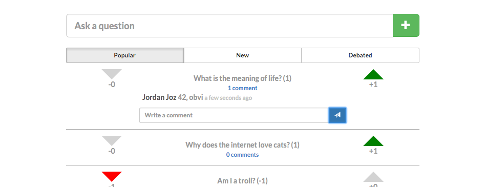
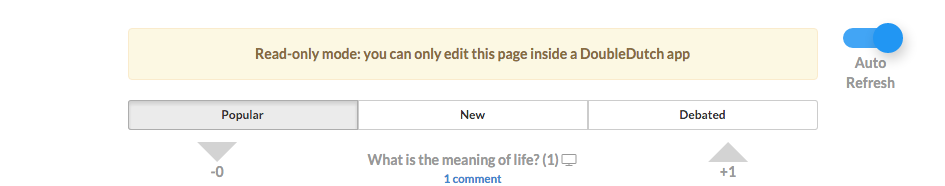
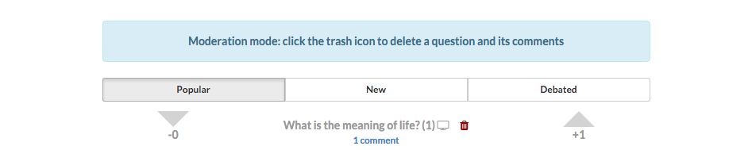

# DD Vote
[](https://travis-ci.org/doubledutch/dd-vote) [](https://codeclimate.com/github/doubledutch/dd-vote)

A simple reddit-style voting app.



## Local setup
1. Download and install [Go](https://golang.org/https://golang.org/) and [Postgres](http://postgresapp.com/)
2. Create a `DB_CONN` environment variable for pg. [See below for details](https://github.com/doubledutch/dd-vote#configuration)
3. Run the app!

  ```bash
  go run main.go
  ```


## Configuration
* `DB_CONN` connection string to Postgres database
  * Local example: `export DB_CONN="password=mysecretpassword host=localhost port=5432 sslmode=disable"`
* `POSTGRES_ADDR` address to pg db. **Ignore when linking to pg container**
* `POSTGRES_PORT` port for pg db. **Ignore when linking to pg container**
* `POSTGRES_DATABASE` name of pg database
* `POSTGRES_USERNAME` username for pg db
* `POSTGRES_PASSWORD` password for pg db
* `AUTH_SECRET` a random string of characters used to encrypt cookies
* `GIN_MODE` {'debug', 'release'} release mode doesn't show route:function mappings


## Architecture
* [Go](https://golang.org/) API
  * [Gin](https://github.com/gin-gonic/gin) for routing
  * [Gorm](https://github.com/jinzhu/gorm) as an ORM
* Web app
  * [AngularJS](https://angularjs.org/)

## View Modes
* **Voting mode**, as seen above
* **Admin Panel** for exporting CSV reports
* **Presentation mode** for showing a question fullscreen (click on the TV icon)
* **Read-only mode** for viewing data outside of a DoubleDutch app (note that the Auto-Refresh toggle can be turned on to keep getting a stream of new data)

* **Moderation mode** for deleting questions


## Docker

### Build the containers
Build the go api container from the root directory
```bash
GOOS=linux GOARCH=amd64 go build && docker build -t dd-vote .
```

Build the Postgres database container from the `/pg` directory
```bash
docker build -t dd-vote-pg .
```

## Migrations

### Seeding
To access the admin tools, we need to create our SuperAdmin.  First create a user in the users table
```sql
INSERT INTO users (email, password) VALUES ('superadmin@doubledutch.me', 'supercomplexpassword');
```

Using the id for that user, give the user SuperAdmin permission
```sql
INSERT INTO permissions (user_id, role) VALUES (1, 0);
```

## TODO
* Add *ModifiedSince* header to avoid getting all questions every time
* Use a websocket or push-based data to provide instant updates to clients
* Hash passwords
* Improve process for db migrations and seeding
    
